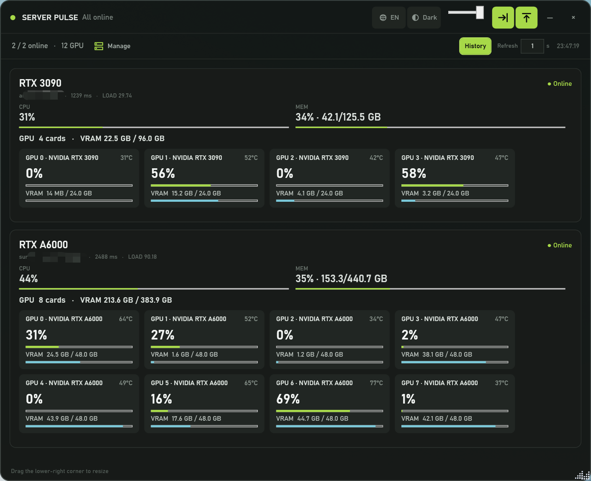
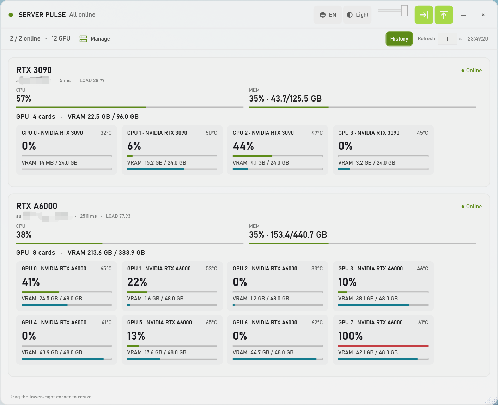
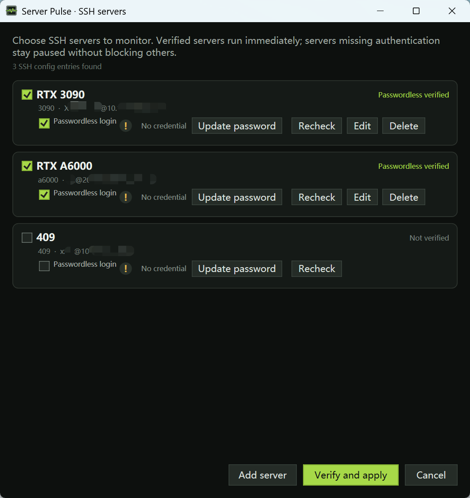
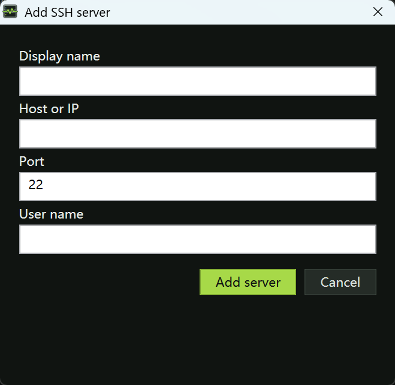
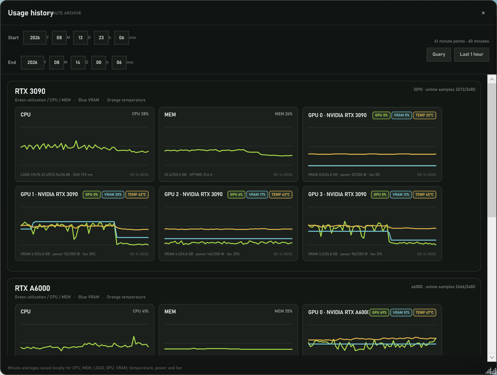
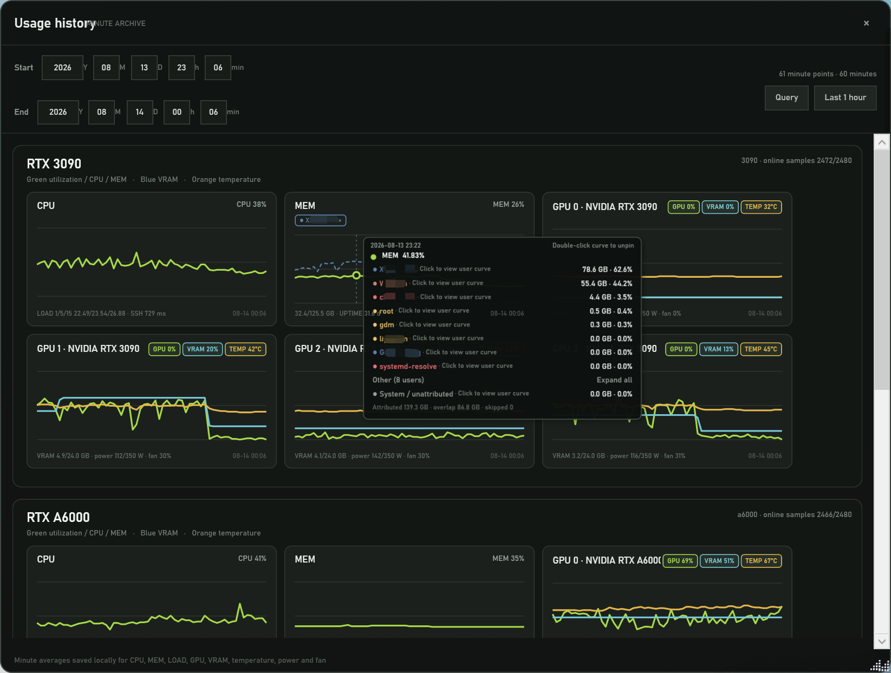

# Server Pulse

Server Pulse 是一个面向 Windows 的原生桌面浮窗，用来实时查看 SSH 服务器的 GPU、显存、CPU 和内存。它不是网页应用，不需要浏览器，也不会在本机启动 HTTP 服务。

当前仓库默认提供两个 SSH 别名：`3090` 和 `a6000`。你可以继续使用现有的免密 SSH，也可以在服务器管理窗口中使用普通密码认证。

## 你可以用它做什么

- 在一个紧凑浮窗中同时查看多台服务器。
- 重点显示每张 GPU 的利用率、显存占用和温度，并显示 GPU 型号。
- 查看 CPU、系统内存和逐卡显存的用户归属；详细列表默认隐藏，悬停预览、单击固定。
- 将窗口贴到屏幕左侧、右侧或顶部自动隐藏，调节尺寸、背景透明度和刷新间隔。
- 从托盘恢复、隐藏或退出，不在任务栏中重复显示窗口。
- 使用暗色、亮色或跟随系统主题；界面支持中文、English 和跟随系统语言。
- 打开“记录”窗口查询分钟级曲线，查看 CPU、MEM、GPU、显存和温度历史。
- 在“记录”页面展开“记录设置”，选择 1–3650 个自然日或“永不清理”，并把整个 Server Pulse 数据根目录迁移到本机其他目录。

## 界面预览

以下截图来自 `demo/`，其中主机地址和用户名已做脱敏处理：

| 暗色主界面 | 亮色主界面 |
| --- | --- |
|  |  |

| SSH 服务器管理 | 添加 SSH 服务器 |
| --- | --- |
|  |  |

| 历史记录 | 历史详情与用户曲线 |
| --- | --- |
|  |  |

## 快速开始

### 环境要求

- Windows 10 或 Windows 11。
- 系统自带 Windows PowerShell 5.1 和 WPF。
- 本机可以调用 OpenSSH 客户端 `ssh.exe`。
- 远端为 Linux，提供 `/proc`、POSIX `sh` 和 `nvidia-smi`（没有 NVIDIA GPU 时，CPU 和内存仍可监控）。

### 启动

双击 `ServerPulse.exe` 即可。也可以双击 `Start Server Pulse.vbs`；它会优先启动 EXE，在 EXE 不存在时才回退到脚本启动方式。

需要查看启动错误时，在项目目录执行：

```powershell
.\ServerPulse.exe
# 或直接运行 PowerShell 脚本
powershell.exe -NoProfile -ExecutionPolicy Bypass -File .\ServerPulse.ps1
```

首次运行前，可以在终端验证现有免密配置：

```powershell
ssh -o BatchMode=yes 3090 hostname
ssh -o BatchMode=yes a6000 hostname
```

如果命令能返回主机名，打开“管理”后勾选对应服务器，点击“验证并应用”即可开始监控。

## SSH 服务器与密码

点击主窗口在线统计右侧的“管理”，或右键托盘图标并选择“SSH 服务器”，打开服务器管理窗口。

候选服务器来自三处：

1. 仓库中的 `config/servers.json`；
2. 当前 Windows 用户 `~/.ssh/config` 中不含通配符的具体 `Host`；
3. 你在管理窗口中手动添加的服务器。

服务器行中的“监视”复选框决定是否生成实时卡片。点击“验证并应用”后，已验证的服务器立即开始监控；缺少认证的服务器会保持暂停，不会阻塞其他服务器。

### 认证顺序

程序固定按以下顺序尝试连接：

1. SSH 密钥或 `ssh-agent` 的免密登录；
2. Windows 凭据管理器中已经保存的凭据；
3. 当前运行中输入、仅保存在内存中的密码。

“免密登录”是检测结果，不是让程序绕过认证的开关。旁边的 `!` 提示会解释密钥、`ssh-agent`、凭据管理器和终端 SSH 之间的区别。

Windows 凭据管理器是 Windows 自带的安全存储，不需要单独安装。Server Pulse 保存的凭据只供本程序使用；普通终端中的 `ssh` 不会自动读取它们，也不会修改全局 `SSH_ASKPASS` 或 OpenSSH 配置。

密码框默认不保存密码。只有勾选“存入 Windows 凭据管理器”并且连接验证成功后，才会写入凭据。未保存的密码在取消监视或退出程序时清除，不写入服务器配置、日志或历史文件。

首次遇到未知主机时，程序会显示主机密钥算法和 SHA256 指纹，确认后才写入当前用户的 `known_hosts`。指纹变化会严格阻断，不会自动覆盖旧密钥。

## 主窗口操作

### 顶栏

- **主题**：选择“亮”“暗”或“跟随系统”，默认暗色。
- **语言**：选择“中文”“English”或“跟随系统”，当前默认中文。
- **透明度**：滑块只改变背景透明度，文字、数字、状态灯和进度条保持清晰。
- **置顶**：点击向上箭头按钮切换始终置顶。
- **贴边**：点击抵边箭头按钮启用左、右、顶部贴边隐藏。
- **刷新**：输入 `1`–`300` 秒，按 Enter 或移开焦点生效。
- **记录**：打开历史记录窗口。
- **管理**：打开 SSH 服务器管理窗口。

### 移动、贴边和托盘

- 拖动顶栏空白处移动窗口。
- 拖动右下角点阵手柄调整大小；最小尺寸约为 340 × 300。
- 拖到左、右或顶部边缘后，窗口会在短暂延迟后收起，只保留边缘窄条。
- 收起后先把鼠标移开边缘，再次触碰对应边缘即可恢复。鼠标停留在展开的窗口内部时不会因离开某个指标弹窗而收起；只有离开整个窗口后才会重新计时。
- 点击标题栏的 `—` 隐藏到托盘；点击 `×` 退出程序。托盘左键恢复窗口，右键提供显示、隐藏和退出。

### 指标和用户明细

- **CPU**：显示整台服务器的 CPU 百分比。
- **MEM**：显示百分比以及已用/总内存，例如 `73% · 92.2/125.5 GB`。
- **GPU**：每张卡显示型号、利用率、显存已用/总量和温度；GPU 区域是主要监控内容。

把鼠标移到 CPU、MEM 或单卡“显存”数值/进度条上可预览用户占用。单击固定面板，再次单击同一指标、点击空白处或按 `Esc` 关闭；点击另一个指标会直接替换。默认显示当前占用最高的前 8 名，系统/未归属始终单列在末尾。

用户归属状态可能是“正常”“部分可用”或“不可用”。权限不足不会被伪装成零占用。

## 记录：查询、曲线和保存机制

点击主窗口醒目的“记录”按钮，默认打开最近 1 小时。开始和结束时间可以分别输入年、月、日、时、分；越界或无效日期会立即以红框和红色 `!` 标记。

记录窗口支持：

- CPU、MEM 和每张 GPU 的 GPU/VRAM/TEMP 曲线分别显示或隐藏；
- 鼠标按分钟定位，浮窗显示完整时间，并用颜色圆点分行列出同一分钟的所有指标；
- 单击曲线固定浮窗，双击曲线解除固定；
- 单击用户行切换用户曲线，每张图最多 3 条，关闭记录窗口后清空选择；
- 缺失分钟保持断线，不把缺口前后的点直接相连；
- 同一天同时读取旧版 JSON 和新版 JSONL，不迁移或删除旧数据。

### 本地历史目录

历史文件只保存在当前 Windows 用户本机。默认数据根目录为 `%LOCALAPPDATA%\ServerPulse\`；记录页首次打开会要求明确保存设置，默认预选 7 天。查询范围不再单独限时，早于保留范围的查询只显示“所选时间段暂无记录”。

```text
%LOCALAPPDATA%\ServerPulse\
├─ settings.json           # 界面、刷新间隔、保留策略
├─ servers.json            # 当前服务器列表（不含密码）
├─ error.log               # 本地错误摘要
└─ history\
   ├─ yyyy-MM-dd.v2.jsonl  # 新格式：一行一个分钟记录，追加写入
   └─ yyyy-MM-dd.json      # 旧格式：继续兼容读取
```

具体规则：

- 新记录按本地日期追加到 `yyyy-MM-dd.v2.jsonl`。保留时长按自然日计算，允许 `1–3650` 天；“永不清理”会跳过所有自动删除。
- 如果设置文件中的保留策略损坏或超出范围，程序会安全回到未配置状态并在下一次打开记录页时要求重新确认，不会因历史设置阻止主窗口启动。
- 保存记录设置时会同时应用保留天数、永不清理和清理暂停状态；参数校验失败会留在配置弹窗内，不会阻止主监控继续运行。
- 首次配置记录弹窗使用独立的 WPF XAML 命名空间，并在保存失败时把具体原因留在弹窗内；历史模块和主窗口回调会预先捕获存储写入、目录切换与本地化依赖，点击事件不再动态查找函数，避免旧启动器或 PowerShell 事件闭包因加载顺序导致“保存设置”无响应。
- 缩短保留时长时可选择“立即清理”“下次启动清理”或“不清理”。“下次启动清理”是一次性动作，启动完成后会自动清除标记；最后一项会保存新天数但暂停自动清理，并在设置面板显示“清理已暂停”。
- 每行保存一个版本 2 的分钟记录；程序重启导致同一分钟出现多行时，会按有效样本数加权合并。
- 文件末尾若有崩溃留下的不完整行，只忽略该行并记录错误，不影响此前记录。
- 旧版 `yyyy-MM-dd.json` 继续读取，不迁移、不删除；同一天的新旧格式可以混合查询。
- 用户在某个可用采样中没有出现，会按零参与分钟平均；不可用采样不进入该资源的分母；旧版记录缺少用户字段时，用户曲线显示断线而不是补零。
- 自动清理同时处理旧 `.json` 和新版 `.v2.jsonl`。删除整个 `history` 目录只会清空记录，不影响窗口设置或服务器配置。
- 文件保存 UID、用户名和分钟聚合值，不保存 PID、进程名、命令行或密码。

历史可能包含敏感的运维信息。请勿把 `%LOCALAPPDATA%\ServerPulse\history` 上传到公开仓库。

### 数据目录设置、迁移与回退

“记录设置”中的路径是整个数据根目录，不是只有 `history` 子目录。路径支持 `%LOCALAPPDATA%` 等环境变量，只接受本机绝对路径，不接受相对路径或 UNC 网络路径；保存前会自动创建目录并测试读写权限。离开默认目录时程序会显示一次隐私提示。

路径变更会先刷新当前分钟记录、暂停新的历史写入，并显示源目录、目标目录、文件数和估算大小。目标存在同名文件时，可以选择覆盖、自动合并或取消，弹窗默认聚焦“取消迁移”；覆盖会先备份目标，自动合并会去除完全相同的 JSON/JSONL 记录、保留冲突分钟记录，并追加合并 `error.log`。迁移成功后旧目录改名为带时间戳的备份，`ServerPulse.location.json` 再原子指向新目录；失败时保留原目录并回滚。Windows 凭据管理器中的密码不会迁移。

如果首选目录被删除、断盘或失去权限，本次运行会明确回退到默认目录并提示重新选择；设置面板在回退期间显示当前实际使用的默认目录，保留时长等修改会写入默认活动目录，首选路径仍会保留在指针文件中，不会静默切换到未知目录。

指针文件位于默认目录之外：

```text
%LOCALAPPDATA%\ServerPulse.location.json
```

它只保存版本、首选/活动数据根目录和待同步状态，不保存密码、历史数据或用户指标。

## 本地配置目录

```text
%LOCALAPPDATA%\ServerPulse\
├─ settings.json       # 主题、语言、窗口位置/尺寸、刷新间隔和记录策略
├─ servers.json        # 当前用户的服务器列表，不含密码
├─ history\            # 分钟历史（见上节）
└─ error.log           # UI 或历史查询异常摘要
```

Windows 持久凭据不写入上述 JSON 文件，而是保存在 Windows 凭据管理器中，并按规范化的 `用户名@主机:端口` 绑定。删除 `settings.json` 会恢复默认界面设置；删除 `servers.json` 会在下次启动时重新从仓库配置和 SSH 配置发现服务器。

仓库中的 `config/servers.json` 只是首次运行的种子配置，不保存密码；其中的 `historyRetentionDays` 只作为兼容配置参考，首次打开记录页仍默认预选 7 天，保存后以 `settings.json` 为准：

```json
{
  "pollIntervalMs": 5000,
  "sshTimeoutMs": 8000,
  "historyRetentionDays": 30,
  "servers": [
    { "id": "3090", "label": "RTX 3090", "host": "3090" },
    { "id": "a6000", "label": "RTX A6000", "host": "a6000" }
  ]
}
```

## 仓库目录

```text
server_monitoring/
├─ ServerPulse.exe          # 可直接运行的 Windows 宿主
├─ ServerPulse.ps1         # 主窗口脚本入口
├─ Start Server Pulse.vbs  # 兼容启动器
├─ assets/                  # SVG/ICO 图标
├─ config/                  # 首次运行种子配置
├─ scripts/                 # 构建脚本
├─ src/                     # 采集器、历史、存储、SSH、主题和宿主源码
├─ tests/                   # 自动化测试和模拟 SSH
├─ docs/DEVELOPMENT.md      # 面向贡献者的开发文档
├─ AGENTS.md                # 仓库协作约定
└─ README.md               # 本说明书
```

## 常见问题

**为什么服务器显示离线？** 先运行 `ssh -o BatchMode=yes <别名> hostname`，检查 SSH 别名、密钥、VPN、跳板机和主机指纹。一个服务器失败不会阻塞其他服务器。

**为什么 GPU 数量为 0？** 在远端执行 `nvidia-smi`。CPU 和内存不依赖 NVIDIA 工具。

**为什么用户明细显示部分可用？** 远端 `/proc` 或 NVIDIA 进程查询可能受权限限制，或者进程在两个采样之间退出。程序会保留整机指标，并明确标记归属不完整。

**保存的密码会被终端 ssh 使用吗？** 不会。它只供 Server Pulse 使用，普通终端 `ssh` 仍按自己的密钥、`ssh-agent` 或手动密码流程工作。

**窗口找不到了怎么办？** 把鼠标移动到贴边位置，或点击托盘图标恢复。仍找不到时删除 `%LOCALAPPDATA%\ServerPulse\settings.json`，程序会恢复默认位置。

**如何报告问题？** 请附上 Server Pulse 版本、Windows 版本、是否使用 EXE、复现步骤和脱敏后的 `error.log`。不要上传历史目录、密码、私钥、真实主机地址或用户列表。

## 开发者文档

架构、采集协议、历史数据结构、构建、测试、安全边界和发布检查清单位于 [`docs/DEVELOPMENT.md`](docs/DEVELOPMENT.md)。普通使用者只需要阅读本文。

## 许可证

本仓库当前未附带正式许可证。公开发布前，请根据你的意愿补充许可证文件；在此之前，默认不授予复制、修改或再发布权利。
